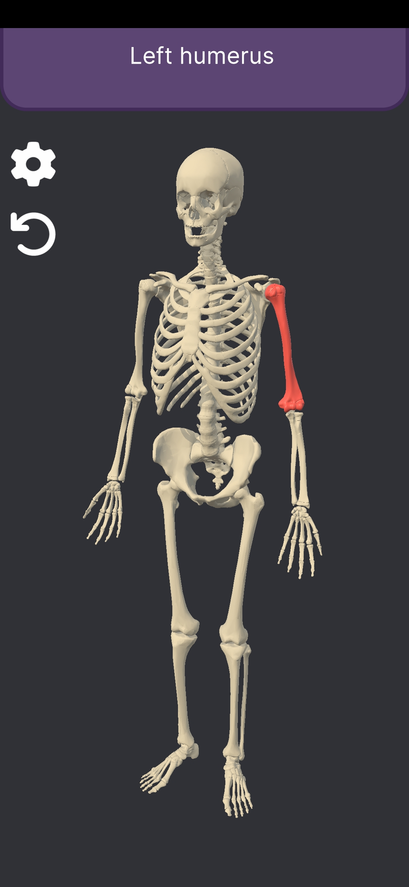

# SkeletonScholar

    

This repository is for a free Android application made in Unity that helps people learn anatomical terms. In this application users can inspect an anatomically correct 3D model of a human body in order to learn the shape and name of different parts of the body

If you are interested in participating in the closed testing, please send an email to tihaneapps@gmail.com

    
    

Available languages: English, Estonian

Available anatomical systems: Skeletal system

Models used in the application originate from https://lifesciencedb.jp/bp3d/. Full credit to DBCLS and everyone else invloved in the project. The models have been modified to better suit the needs of this application. See license for additional information.
